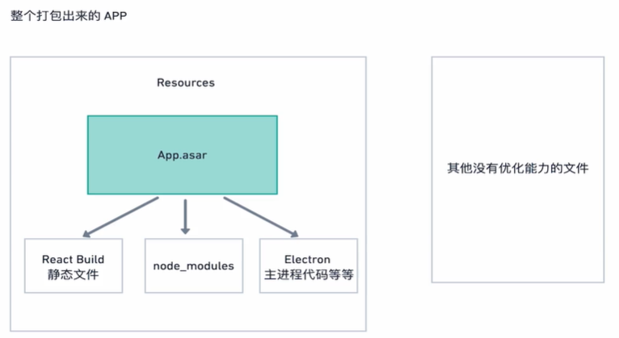

# cloud doc(云笔记)


# 项目介绍

基于 electron 框架的云笔记应用.

## 完成功能：

1. markdown 编辑笔记
2. 文件保存到本地
3. 选择保存文件地址
4. 文件上传到七牛云
5. 导入本地 md 文件到应用
6. 自定义菜单
7. 自动版本更新

# 技术总结

## electron 结合 react 开发

在 electron 的 `BrowserWindow` 对象的 `loadURL` 方法传入加载页面的链接，可以是本地文件地址或远端链接，在本地开发时，将 url 设置为 React 项目启动的地址即可：

```js
// ./src/utils/createWindow.js

const createMainWindow = () => {
  // ...
  // 判断是否是开发环境
  const urlLocation = isDev
    ? 'http://localhost:3000'
    : `file://${path.join(__dirname, './index.html')}`;
  const mainWindow = new AppWindow(mainWindowConfig, urlLocation);
  return mainWindow;
};
```

## 使用命令行先后启动项目

原理：使用 concurrently 等待本地 3000 端口启动后，再启动 electron 项目，

配置的命令行如下：

```json
// ./package.json
{
  "dev": "concurrently \"wait-on http://localhost:3000 && electron .\" \"cross-env BROWSER=none yarn start\""
}
```

## 部分 html 页面单独打包

项目混合静态 html 文件进行开发，需要对这部分文件进行单独打包，使用 `webpack` 进行打包，使用 `copy-webpack-plugin` 实现复制文件，配置项如下：

```js
const path = require('path');
const CopyPlugin = require('copy-webpack-plugin');

module.exports = {
  // webpack 为 electron 定制的选项
  target: 'electron-main',
  // 入口文件
  entry: './main.js',
  // 输入的目录和文件名
  output: {
    path: path.resolve(__dirname, './build'),
    filename: 'main.js',
  },
  // 打包模式
  mode: 'production',
  // 使 webpack 不要替换我们的 __dirname 代码
  // 因为项目需要使用到 Path 读取文件
  node: {
    __dirname: false,
  },
  // 基本目录，配置解析入口
  context: path.resolve(__dirname, '.'),
  // 配置插件
  plugins: [
    new CopyPlugin({
      patterns: [
        {
          from: './setting',
          to: './setting',
          // 配置复制的类型为：复制文件夹
          toType: 'dir',
        },
        // ...
      ],
    }),
  ],
};
```

## electron 打包命令配置

打包分为两步，react 项目打包和 electron 命令打包，配置命令如下

```json
// package.json
{
  "scripts": {
    // 使用 builder 进行打包
    "win": " electron-builder --win",
    // 打包前，需要将项目打包为静态文件
    "prewin": "npm run build && npm run buildMain"
  }
}
```

## electron 打包配置

进行打包配置，[参考链接](https://www.electron.build/generated/platformspecificbuildoptions)

```json
// package.json
{
  // 设置应用的根路径，应用安装的目录为根路径，控制 cra 打包的配置
  "homepage": "./",
  "build": {
    // 将打包进行归档
    "asar": true,
    "appId": "my.cloud.doc",
    "productName": "cloudDoc",
    "copyright": "Copyright © 2021",
    // 手动添加需要打包的文件
    // ** 匹配所有文件夹和他们的子文件
    // * 匹配当前路径下的文件
    "files": ["build/**/*", "node_modules/**/*", "package.json"],
    // 使用react-cra时，会自动修改入口文件，我们需要禁止掉
    "extends": null,
    // 自定义入口文件，需定义为 webpack 打包后的入口文件
    "extraMetadata": {
      "main": "./build/main.js"
    },
    // 配置目录
    "directories": {
      "buildResources": "assets"
    }
  }
}
```

## 跨平台打包配置

```json
// package.json
{
  //...
  "build": {
    // mac配置
    "mac": {
      "category": "public.app-category.productivity",
      "artifactName": "${productName}-${version}-${arch}.${ext}"
    },
    // linux配置
    "dmg": {
      "background": "assets/appdmg.png",
      "icon": "assets/icon.icns",
      "iconSize": 100,
      "contents": [
        {
          "x": 380,
          "y": 280,
          "type": "link",
          "path": "/Applications"
        },
        {
          "x": 110,
          "y": 280,
          "type": "file"
        }
      ],
      "window": {
        "width": 500,
        "height": 500
      }
    },
    // windows 配置
    "win": {
      "target": "nsis-web",
      "icon": "build/logo256.ico",
      "artifactName": "${productName}-Web-Setup-${version}.${ext}",
      "publisherName": "Kandra Labs, Inc."
    },
    "nsis": {
      "allowToChangeInstallationDirectory": true,
      "oneClick": false,
      "perMachine": false
    }
  }
}
```

## 打包优化

electron 项目打包资源分布：



左侧为项目的源代码，使用 asar 将代码混合打包后的文件，主要包含 react 打包后的静态文件，node_modules 包依赖文件，Electron 主进程代码，右侧为不可优化的 electron 相关的代码，包含 chromium 内核、node 运行时和原生应用相关代码，如图：


图片来源于：[Electron 运行原理](https://blog.csdn.net/k157507281/article/details/99411152)

可知，如需要对项目进行优化，需要从自己的代码入手。根据分析，打包后项目大的罪魁祸首是 `node_modules` ，在代码中，我们需要将运行时需要用到的包放置到 `devDependencies` 配置下，其次需要配置打包的文件与文件夹，尽量减少打包的文件数量，配置如下：

```json
// package.json
{
  "dependencies": {
    "electron-is-dev": "^1.2.0",
    "electron-store": "^7.0.2",
    "qiniu": "^7.3.2"
  },
  "devDependencies": {
    "axios": "^0.21.1",
    "electron": "^11.3.0",
    "react": "^17.0.1"
    // ...
  },
  "build": {
    "files": ["build/**/*", "node_modules/**/*", "package.json"]
  }
}
```

## 版本升级

使用 electron-builder 实现版本升级，版本升级需要两步，第一步，配置上传和打包信息，第二步，编写代码实现检测版本升级，下载新版本软件

第一步：配置上传和打包信息

```json
{
  // 配置版本
  "version": "1.1.3",
  "scripts": {
    // 配置版本发布命令
    "prerelease": "npm run build && npm run buildMain",
    "release": "cross-env GH_TOKEN= electron-builder"
  },
  "build": {
    // 配置发布仓库
    "publish": ["github"]
  }
}
```

第二步：代码部分

```js
// ./main.js
const { autoUpdater } = require('electron-updater');

// 配置检查版本信息
const checkVersion = autoUpdater => {
  if (isDev) {
    autoUpdater.updateConfigPath = path.join(__dirname, 'dev-app-update.yml');
    autoUpdater.checkForUpdates();
  } else {
    autoUpdater.checkForUpdatesAndNotify();
  }
};

// ...
app.on('ready', () => {
  // 关闭自动下载
  autoUpdater.autoDownload = false;
  // 检查版本信息
  checkVersion(autoUpdater);
  // 自动升级出错处理
  autoUpdater.on('error', error => {
    dialog.showErrorBox('Error', error === null ? 'unknow' : error);
  });
  // 有版本升级，弹窗提示
  autoUpdater.on('update-available', () => {
    dialog
      .showMessageBox({
        type: 'info',
        title: '应用有新的版本',
        message: '发现新版本，是否现在更新',
        buttons: ['是', '否'],
      })
      .then(result => {
        if (result.response === 0) {
          autoUpdater.downloadUpdate();
          updateWindow = createUpdateWindow(mainWindow);
          updateWindow.on('closed', () => {
            updateWindow = null;
          });
        }
      });
  });
  // 没有版本升级
  autoUpdater.on('update-not-available', () => {
    if (isAutoCheckedUpdate) {
      isAutoCheckedUpdate = false;
    } else {
      dialog.showMessageBox({
        title: '没有新版本',
        message: '当前已经是最新版本',
      });
    }
  });
  // 下载进度
  autoUpdater.on('download-progress', progressObj => {
    if (updateWindow) {
      updateWindow.webContents.send('download-progress', { progressObj });
    }
  });
  // 下载完成
  autoUpdater.on('update-downloaded', () => {
    // 模拟一个下载完成事件
    updateWindow.webContents.send('download-progress', {
      progressObj: {
        percent: 100,
      },
    });
    dialog
      .showMessageBox({
        title: '安装更新',
        message: '更新下载完毕，应用将重启并进行安装',
        buttons: ['是', '否'],
      })
      .then(result => {
        if (result.response === 0) {
          setImmediate(() => autoUpdater.quitAndInstall());
        }
      });
  });
}
```

## QQ 登陆后，页面刷新

QQ 登陆后，需要实现页面刷新，QQ 登录需要拼接链接打开三方地址，如何实现通信是一个问题。因为 QQ 登录后，会重定向到服务端，服务端会返回页面，这个页面会展示在原来的窗口，此时，我们需要在这个窗口内写代码，实现将数据写入本地、发出事件通知登录成功、关闭当前窗口，代码如下：

```js
// 服务端使用 ejs 模板，将数据注入模板
// <% 正常的语句，没有输出
// <%- 代表数据不进行转义
// <%= 代表需要进行转义
const userInfo = '<%- JSON.stringify(userInfo) %>';
const Store = require('electron-store');
if (Store) {
  const { ipcRenderer, remote } = require('electron');
  const userStore = new Store({ name: 'user-info' });
  // 将信息设置到 dtore 内
  userStore.set('userData', JSON.parse(userInfo));
  // 发出事件，通知登录成功
  ipcRenderer.send('login-success');
  // 关闭当前窗口
  remote.getCurrentWindow().close();
}
```

拓展：页面通信的几种方式，

[js 页面间的通信](https://www.cnblogs.com/codetker/p/4684240.html)

[localstorage 更新监测 storage 事件](https://www.cnblogs.com/mengfangui/p/10736317.html)

## 相关

[OAuth 的改变--火丁笔记](https://blog.huoding.com/2011/11/08/126)

[OAuth 那些事儿--火丁笔记](https://blog.huoding.com/2010/10/10/8)

[OAuth 2.0 的一个简单解释--阮一峰](http://www.ruanyifeng.com/blog/2019/04/oauth_design.html)

[OAuth 2.0 的四种方式--阮一峰](http://www.ruanyifeng.com/blog/2019/04/oauth-grant-types.html)

[OAuth 1.0，1.0a 和 2.0 的之间的区别有哪些？](https://www.zhihu.com/question/19851243)

[QQ 互联](https://wiki.connect.qq.com)
