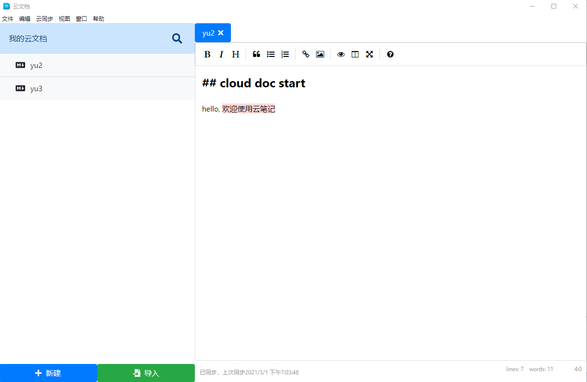

# cloud doc(云笔记)



# 项目介绍

基于 electron 框架的云笔记应用.

## 完成功能：

1. markdown 编辑笔记
2. 文件保存到本地
3. 选择保存文件地址
4. 文件上传到七牛云
5. 导入本地 md 文件到应用
6. 自定义菜单
7. 自动版本更新

# 问题记录

1. electrin 如何搭配 react 开发

`electron` 使用 `loadURL` 加载页面资源，在本地开发时，使用 `http://localhost:3000` 来载入 react 应用，且可热加载

2. 打包配置

可知，electron 应用是由 `main process` 和 `renderen process` 构成，react 打包过后会将打包后的文件放在 `build` 文件夹下，electron-builder 打包默认为打包整个项目，

在 package.json 配置打包命令：

```sh
"scripts": {
    ...
    "win": " electron-builder --win",
    "prewin": "npm run build",
    ...
}
```
